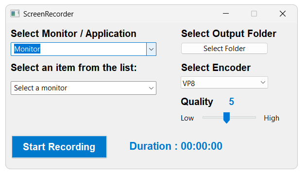

# ⚡ Low Latency Screen Recorder

**Low Latency Screen Recorder** is a lightweight, high-performance screen capture tool built with modern C++ and [wxWidgets](https://www.wxwidgets.org/). Designed for ultra-low latency and high frame rates, it leverages the **Windows Graphics Capture API** (WinRT) and hardware-accelerated **Direct3D 11** to record your entire screen or a specific application window, encoding in real time to **H.264 MP4** or **VP8/VP9 WebM**.

---

## 🖼️ Application UI



---

## 🚀 Features

- 🎥 **Capture at your monitor's native refresh rate** (60 Hz, 144 Hz, 240 Hz, etc.)
- ✔ **Target a specific application** or record the full screen (multi-monitor supported)
- 👀 **Hidden recorder UI** — the recorder window is excluded from capture output
- ⚙️ **Multiple encoder support**
  - **H.264** — hardware-accelerated via Media Foundation SinkWriter → `.mp4`
  - **VP8 / VP9** — software encoding via libvpx → `.webm` (including VP9 4:4:4 profile)
- 🎚️ **Adjustable quality slider** (1–10) controlling bitrate on the fly
- 📂 **Custom output folder** — choose where recordings are saved, or default to the user's Videos folder
- 🔄 **Dynamic resolution handling (VP8 / VP9 Only)** — automatically adapts when the captured window or monitor resolution changes mid-recording
- 🖥️ **DPI-aware** — correctly handles system DPI scaling on Windows 10/11
- 🤏 **Minimal dependencies**, small binary size

---

## 🏗️ Architecture

```
┌──────────────────────────────────────────────────────────┐
│                      UI (wxWidgets)                      │
│         MainWindow.cpp - Frame, DataManager, App         │
└────────────────────────────┬─────────────────────────────┘
                             │
┌────────────────────────────▼─────────────────────────────┐
│                    RecordingHandler                      │
│                    ScreenRecorder.cpp                    │
└──────────┬──────────────────────────────┬────────────────┘
           │                              │
┌──────────▼─────────┐  ┌─────────────────▼────────────────┐
│   CaptureEngine    │  │      VideoEncoder (Factory)      │
│                    │  │                                  │
│   WinRT +          │  │  ┌────────────┐ ┌─────────────┐  │
│   Direct3D 11      │  │  │ MFT H.264  │ │ VPX VP8/VP9 │  │
│                    │  │  │ SinkWriter │ │ libvpx +    │  │
│   Captures BGRA    │  │  │   → .mp4   │ │ WebM Muxer  │  │
│   frame buffers    │  │  └────────────┘ │   → .webm   │  │
│                    │  │                 └─────────────┘  │
└────────────────────┘  └──────────────────────────────────┘

   CaptureEngine ───(BGRA callback)───▶ VideoEncoder
```

### Key Modules

| Module | Path | Description |
|---|---|---|
| **CaptureEngine** | `CaptureEngine/` | Uses `Windows.Graphics.Capture` (WinRT) with a free-threaded `Direct3D11CaptureFramePool`. Captures frames as D3D11 textures, maps them to CPU-readable BGRA buffers, and delivers them via a callback. Handles both monitor and per-window capture. |
| **RecordingHandler** | `RecordingHandler/` | Orchestrates the capture engine and video encoder. Manages output folder creation, file naming (timestamped), and the start/stop lifecycle. |
| **VideoEncoder** | `VideoEncoder/` | Factory-based encoder selection (`VideoEncoderFactory`). Two encoder backends: `MFTH264VideoEncoder` (Media Foundation Transform → MP4) and `VPXVideoHandler` (libvpx VP8/VP9 → WebM via `WebmVideoFileWritter` using libwebm's MKV muxer). Color space conversion (BGRA → NV12 / I444) is done via **libyuv**. VPX encoding runs on a dedicated processing thread with a frame queue. |
| **UI** | `UI/` | wxWidgets-based GUI. Enumerates monitors and visible windows, provides encoder selection (VP8, VP9, H264), a quality slider, output folder picker, and a start/stop button with a live duration timer. |
| **Utils** | `Utils/` | Timestamp formatting helpers. |

---

## 🛠️ Tech Stack

| Component | Technology |
|---|---|
| Language | C++17 (MSVC) |
| UI Framework | wxWidgets |
| Screen Capture | Windows.Graphics.Capture (WinRT) + Direct3D 11 |
| H.264 Encoding | Media Foundation SinkWriter |
| VP8/VP9 Encoding | libvpx |
| Container Muxing | libwebm (MKV/WebM) |
| Color Conversion | libyuv |
| Build System | Visual Studio 2026 (`.sln` / `.vcxproj`) |

---

## 📦 Supported Output Formats

| Encoder | Codec | Container | Extension |
|---|---|---|---|
| Media Foundation | H.264 | MP4 | `.mp4` |
| libvpx | VP8 | WebM | `.webm` |
| libvpx | VP9 (4:2:0) | WebM | `.webm` |
